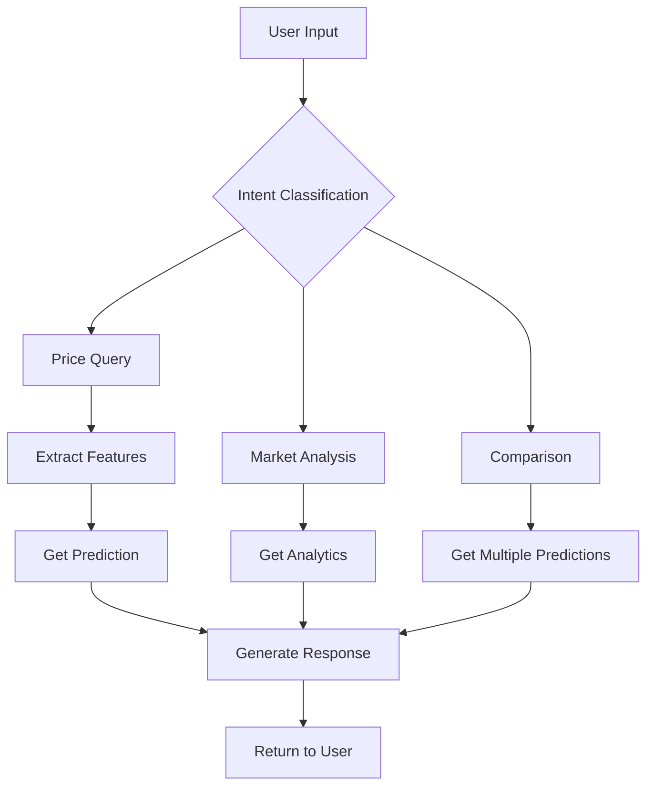

# 🤖 Chatbot Integration Guide for RealyticsAI

## Overview
This guide explains how to integrate a natural language chatbot that understands property price queries and responds conversationally.

## Architecture

```
User Query (Natural Language)
        ↓
[Chatbot Orchestrator]
        ↓
[Intent Classification] → Determines user's intent
        ↓
[Entity Extraction] → Extracts property features
        ↓
[Price Prediction Service] → Gets prediction
        ↓
[Response Generation] → Creates natural response
        ↓
Response (Natural Language)
```

## Implementation Approach

### Option 1: OpenAI GPT Integration (Recommended for Production)
- **Pros**: Best NLU, minimal setup, handles complex queries
- **Cons**: API costs, requires internet connection
- **Best for**: Production environments

### Option 2: Open Source LLMs (Llama, Mistral)
- **Pros**: Free, runs locally, data privacy
- **Cons**: Requires GPU, more complex setup
- **Best for**: Privacy-sensitive deployments

### Option 3: Hybrid (NER + Rules + Small LLM)
- **Pros**: Balance of cost and performance
- **Cons**: More development effort
- **Best for**: Cost-conscious production

## Key Components

### 1. Intent Classification
Identifies what the user wants:
- `price_prediction`: User wants to know property price
- `market_analysis`: User wants market insights
- `comparison`: User wants to compare properties
- `recommendation`: User wants property suggestions

### 2. Entity Extraction
Extracts property features from natural language:
- Location: "Whitefield", "Electronic City"
- Bathrooms: "2 bathrooms", "two baths"
- Balconies: "1 balcony", "no balcony"
- Property type: "2BHK", "3BHK apartment"

### 3. Context Management
Maintains conversation state:
- Previous queries
- User preferences
- Clarification tracking

### 4. Response Generation
Creates human-like responses with:
- Price predictions
- Confidence levels
- Market insights
- Recommendations

## Example Conversations

### User Query Examples:
```
"What's the price of a 2 bedroom apartment in Whitefield with 2 bathrooms?"
"How much would a house with 3 bathrooms and 2 balconies cost?"
"I'm looking for a property under 50 lakhs, what areas should I consider?"
"Compare prices between Whitefield and Electronic City for 2BHK"
```

### Chatbot Response Examples:
```
"Based on my analysis, a 2-bedroom apartment in Whitefield with 2 bathrooms 
would typically cost around ₹75-85 lakhs. The market in Whitefield shows 
strong demand with 540 similar properties averaging ₹128 lakhs."

"A property with 3 bathrooms and 2 balconies is estimated at ₹125-135 lakhs. 
This falls in the premium category. Would you like to know about specific 
locations where such properties are available?"
```

## Technical Stack

### Required Libraries:
```python
# NLP & LLM
openai>=0.27.0          # For GPT integration
langchain>=0.0.200      # LLM orchestration
transformers>=4.30.0    # For open source models
spacy>=3.5.0           # NER and text processing
nltk>=3.8              # Text preprocessing

# Vector DB (for context)
chromadb>=0.4.0        # Vector storage
faiss-cpu>=1.7.4       # Similarity search

# API & Async
fastapi>=0.100.0       # API framework
websockets>=11.0       # Real-time chat
```

## Implementation Steps

### Step 1: Setup LLM Provider
```python
# Option A: OpenAI
from openai import OpenAI
client = OpenAI(api_key="your-key")

# Option B: Local LLM
from transformers import pipeline
chatbot = pipeline("text-generation", model="microsoft/DialoGPT-medium")
```

### Step 2: Create Intent Classifier
```python
def classify_intent(query: str) -> str:
    # Use LLM or rule-based classification
    pass
```

### Step 3: Extract Entities
```python
def extract_entities(query: str) -> dict:
    # Extract bathrooms, balconies, location, etc.
    pass
```

### Step 4: Generate Response
```python
def generate_response(prediction: dict, context: dict) -> str:
    # Create natural language response
    pass
```

## Conversation Flow



## Error Handling

### Missing Information:
```
User: "What's the price of a house?"
Bot: "I'd be happy to help! Could you tell me:
     - How many bathrooms?
     - How many balconies?
     - Any preferred location?"
```

### Clarification:
```
User: "Price in Whitefield"
Bot: "I need a bit more information about the property in Whitefield:
     - Number of bathrooms?
     - Number of balconies?
     Or would you like the average price for the area?"
```

## Performance Optimization

1. **Cache frequent queries**: Store common predictions
2. **Batch processing**: Group similar requests
3. **Async operations**: Non-blocking I/O
4. **Token optimization**: Minimize LLM tokens
5. **Local models**: For high-volume, low-latency needs

## Security Considerations

1. **Input validation**: Sanitize user inputs
2. **Rate limiting**: Prevent abuse
3. **Data privacy**: Don't log sensitive information
4. **API key management**: Use environment variables
5. **Content filtering**: Block inappropriate queries

## Monitoring & Analytics

Track:
- Query volume and types
- Response times
- Prediction accuracy
- User satisfaction
- Error rates

## Next Steps

1. Choose LLM provider (OpenAI vs Open Source)
2. Implement basic intent classification
3. Build entity extraction
4. Create response templates
5. Add conversation memory
6. Implement error handling
7. Add analytics and monitoring
